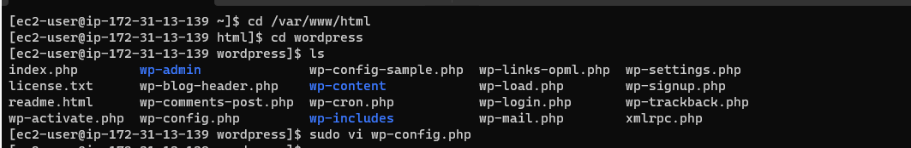

# Implementing  WordPress website with Logical Volume Management (LVM) 

### Project Scope:

- Configure storage subsystem for Web and Database servers, we will work with disks, partitions, and volumes in Linux.

- Install WordPress and connect it to a remote My SQL database server.


##

### Three-tier Architecture

Generally, web or Mobile solutions are Implemented based on what is called Three-tier Architecture

**Presentation Layer(PL)**: This is the user interface such as the client-server or browser on your Laptops.

**Business Layer(BL)**: This is the backend program that implements business logic. Application or webserver.

**Data Access or Management Layer(DAL)**: layer for the computer data storage and data access. Database server or File system such as FTP server or NFs server.


##

1. Launch a RedHat EC2 instance, and create 3 volumes in the same AZ as your EC2 instance.


- Create a volume of 10Gib


2. Attach all three volumes one by one to your web server EC2 instance.


3. Use `lsblk` to inspect what block devices are attached to the server. Names of your newly created devices will show. 

   - All devices reside in `/dev/directory`, inspect it with `ls /dev/`


4. Use `df -h` to see all mounts and free space on your server


5. Use `gdisk` to create a single partition on each of the 3 disks.

   - `sudo gdisk /dev/xvdf`
   - `sudo gdisk /dev/xvdg`
   - `sudo gdisk /dev/xvdh`


6. Use `lsblk` to view the newly configured partitions.


7. Run `sudo yum install lvm2` to install the LMV2 package.  Then `sudo lvmdiskscan` to check for available partitions.

8. Use `pvcreate` to mark each of the 3 disks as physical volumes to be used by LVM.

   Run
    - `sudo pvcreate /dev/xvdf1`
    - `sudo pvcreate /dev/xvdg1`
    - `sudo pvcreate /dev/xvdh1`


9. Run `sudo vgcreate webdata-vg /dev/xvdh1 /dev/xvdg1 /dev/xvdf1` this will add all 3 PV.s to a volume group(VG). We have named the VG web-data.


10. Use `lvcreate` to create 2 logical volumes, one for storing data and the other for logs.

    - `sudo lvcreate -n app-lv -L 14G webdata-vg`
    - `sudo lvcreate -n logs-lv -L 14G webdata-vg`


11. Run `sudo vgdisplay -v` to verify the entire setup then run `lsblk`


12. Next format the logical volumes with **ext4** filesystem

    - Run `sudo mkfs -t ext4 /dev/webdata-vg/apps-lv`
    - Run `sudo mkfs -t ext4 /dev/webdata-vg/logs-lv`

13. Create **/var/www/html** dirctory to store the website files
    
    - `sudo mkdir -p /var/www/html`

14. Create **/home/recovery/logs** to store backup of log data

    - `sudo mkdir -p /home/recovery/logs`


15. Mount **/var/www/html** on **apps-lv** logical volume

    - Run `sudo mount /dev/webdata-vg/apps-lv /var/www/html`

16. - Run `sudo rsync -av /var/log/. /home/recovery/logs/` to backup all the files in the log dir **/var/log** into **/home/recovery/logs** then mount **/var/log** on **logs-lv** `sudo mount /dev/webdata-vg/logs-lv /var/log`


17. Run `sudo blkid` and copy the UUID with the **ext4** filesystem


18. Run `sudo vi /etc/fstab` to update the file so that the mount config will persist after restart of the server. Update the UUID that you copied.


19. Now, test the configuration by running `sudo mount -a` then reload `sudo systemctl daemon-reload`


## Installing Wordpres and configuring to use MySQL 

1. Install Wordpess on the Web Server EC2 instance

   - `sudo yum -y update` to update the repository
   - `sudo yum -y install wget httpd php php-mysqlnd php-fpm php-json` to install wget, Apache and its dependencies.


  - `sudo systemctl enable httpd` then `sudo systemctl start httpd` to start Apache.


2. Install PHP and its dependencies
```
sudo yum install https://dl.fedoraproject.org/pub/epel/epel-release-latest-8.noarch.rpm
sudo yum install yum-utils http://rpms.remirepo.net/enterprise/remi-release-8.rpm
sudo yum module list php
sudo yum module reset php
sudo yum module enable php:remi-7.4
sudo yum install php php-opcache php-gd php-curl php-mysqlnd
sudo systemctl start php-fpm
sudo systemctl enable php-fpm
setsebool -P httpd_execmem 1

```


3. Configure SELinux Policies
```
 sudo chown -R apache:apache /var/www/html/wordpress
 sudo chcon -t httpd_sys_rw_content_t /var/www/html/wordpress -R
 sudo setsebool -P httpd_can_network_connect=1


```


4. Verify that the service is running `sudo systemctl status mysqld`


## Prepare the Database Server

**Launch a second RedHat instance, repeat the same steps as for the web server, use `db-lv` instead of `apps-lv`, and mount it to `/db` directory instead of `/var/www/html`**

1. Install MySQL on the newly created DB Server

   - `sudo systemctl retstart mysqld`

   - `sudo systemctl enable mysqld`

##

### Configure  DB to work with WorPress

```
sudo mysql
CREATE DATABASE wordpress;
CREATE USER `myuser`@`<Web-Server-Private-IP-Address>` IDENTIFIED BY 'mypass';
GRANT ALL ON wordpress.* TO 'myuser'@'<Web-Server-Private-IP-Address>';
FLUSH PRIVILEGES;
SHOW DATABASES;
exit

```


### Configure WordPress to connect to a remote database

  - Open MySQL on port **3306** on the DB Server and allow access to the DB Server only from your web server's private IP.


2. Install MySQL client and test that you can connect from the Web Server to the DB Server by using mysql-client.

  - `sudo yum install mysql`
  - `sudo mysql -u username -p -h <DB-Server-Private-IP-address>`


3. Change permissions and configuration so Apache can use WordPress

   - `cd /var/www/html`

   - `cd wordpress` then `ls ` 

   - `sudo vi wp-config.php`

   - Edit the following: `DB_NAME DB_USER DB_PASSWORD LOCALHOST`

   - enable port 80 from everywhere **0.0.0.0/0**
  
     




 
   


4. Access from your browser the link to your WordPress `http://<web-server0public-ip-addess>/wordpress/`


## THE END !!
